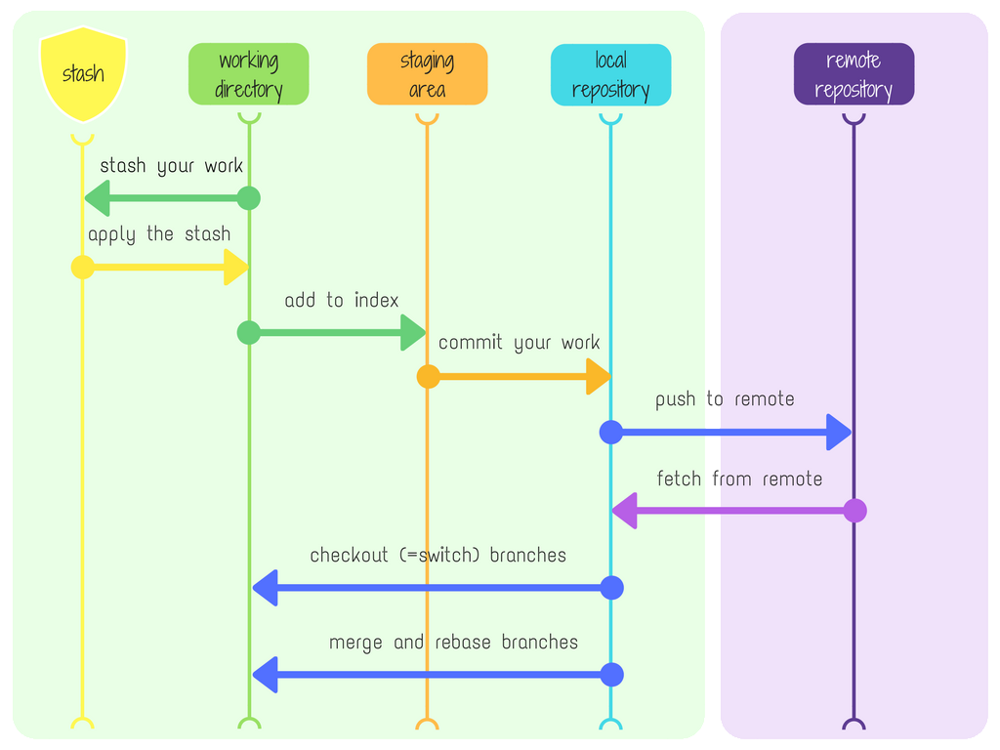

## Version Control System(VCS):
-------------------------------
* A version control system (VCS) is a tool that manages changes to documents, files, or any other collection of information over time. It allows multiple contributors to collaborate on projects by tracking modifications, maintaining a history of changes, and facilitating collaboration without overriding each other's work.
* Version control, also known as source control, is the practice of tracking and managing changes to software code. Version control systems are software tools that help software teams manage changes to source code over time.

* Generally we have two types of version control systems
  * Centralized Version Control Systems (CVCS)
  * Distributed Version Control Systems (DVCS)
 
* **Centralized Version Control Systems**:
------------------------------------------
  * These will store all the files in a central repository, there is a single, central server that stores the entire history of the project and its files. Developers interact with this central server to check out files, make changes, and commit them back. Ex: SubVersion
  * In this collaboration often requires network connectivity to the central server.
  * Relies on a central server for version control, with developers checking out files and committing changes directly to the central repository.
 
* **Distributed Version Control Systems**:
------------------------------------------
  * Distributed version control systems store files across multiple repositories.
  * Each developer clones the entire repository, including its history, to their local machine. This local copy serves as a complete backup with the full history and allows for independent work. Ex: Git
  * They can work independently, making commits to their local repository.
  * Changes can be shared and synchronized between repositories, including the original remote repository.
  * Collaboration does not necessarily require constant network connectivity to a central server.

 

* **GIT(Global Information Tracker)**:
--------------------------------------
* It was introduced by Linus Torvalds, creator of Linux, along with others in the Linux development community, built and released in 2005.
* Git is the most popular open source Distributed Version Control Systems(DVCS) designed for speed and efficiency.
* It tracks changes in files, coordinates work among multiple people, and stores every version of a project's files.
* Git is one of the DevOps tool used for source code management.
* Git is used to tracking changes in the source code, allows multiple developers to work on a project simultaneously while ensuring that their changes do not interfere with one another.

* There are five stages in git they are:

  **Working Tree**:
    * The working tree, also known as the working directory, refers to the directory on your filesystem where you are currently working. It contains the files of your project. Here, we will make the changes

  **Staging area**:
    * The staging area, or index, is a intermediate area between your working directory and the Git repository. It holds changes that you want to include in your next commit. (git add [file name])

  **Local Repository**:
    * The local repository is the database on your local machine where Git stores all the commits and version history of your project.(git commit -m "commit message")

  **Remote Repository**:
    * The remote repository is a copy of your local repository hosted on a remote server like GitHub, GitLab, or Bitbucket. (git push)

  **Stash Area**:
    * The stash area is a temporary storage area in Git where you can store changes that are not ready to be committed or that you want to temporarily set aside.(git stash)

**Terms**:
----------
  **Repository(Repo)**:
  ---------------------
  * A collection of files and folders along with their complete history stored on a remote server or locally.
  
  **Commit**:
  -----------
  * It is the snapshot of the changes made to files in the repository at a particular time. Each commit has a commit ID and this commit          ID. This commit ID will generated for each change that we push and git used SHA-1 alogorithm to generate the commit ID

  **Branch**:
  ----------
  * A parallel version of the repository, allowing changes to be made independently of other branches. we can create branches with any name but the name should be unique with in one repository. While creating a repository we will get a default branch as `main` (or) `master`.

  **Clone**:
  ---------
  * It used to point to an existing repo and make a clone or copy of that repo at in a new directory, at another location.

  **Fork**:
  --------
  * Fork is a copy of an existing repository in which the new owner disconnects the codebase from previous committers.

  **Pull**:
  --------
  * It is used to fetch and download content from a remote repository and immediately update the local repository to match that content.

  **Merge**:
  ----------
  * Integrating changes from one branch into another.

  **Pull Request**:
  ----------------
  * A request to merge changes from one branch into another, typically used for code review in collaborative workflows.

**Git Commands**:
-----------------
  **Configuring user information used across all local repositories**
  -------------------------------------------------------------------
    
  `git config --global user.name “[firstname lastname]”`
  
  `git config --global user.email “[valid-email]`
  
  `git config --global user.password "[GitHub Token]"`

  **Configuring user information, initializing and cloning repositories**
  -----------------------------------------------------------------------
    
  `git init       ---- initialize an existing directory as Git repository`
  
  `git clone [url] --- retrieve an entire repository from a hosted location via URL`

  **Working with snapshots**
  ---------------------------
    
  `git status --- show modified files in working directory, staged for your next commit`
  
  `git add [file] ---  add a file as it looks now to your next commit (adding the changes to staging area)`
  
  `git commit -m “[descriptive message]” --- commit your changes to local repository`
  
  `git push --set-upstream origin <branch-name> --- push the changes to remote repository with a new local branch`
  
  `git push --- push the changes to remote repo`
  
  `git reset [file] --- unstage a file while retaining the changes in working directory`

  **Others**
  ----------
  `git branch --- check the current branch`
  
  `git checkout -b <branch-name> --- create a new branch and checkout the branch`
  
  `git checkout <branch-name> --- checkout to an existing branch`
  
  `git pull --- fetch and merge any commits from the tracking remote branch`
  
  `git log --- show all commits in the current branch’s history`
  
  `git rebase [branch] --- apply any commits of current branch ahead of specified one`
  
  `git stash --- Save modified and staged changes`
  
  `git reset --hard [commit] --- clear staging area, rewrite working tree from specified commit`
  
  `git reset --soft [commit] --- Resets the current branch to the specified commit, but keeps the changes in the index (staging area) and working directory`
  
  `git reset --mixed [commit] --- Resets the current branch to the specified commit and updates the index (staging area), but does not affect the working directory`
  
  `git revert [commit] --- used to create a new commit that undoes the changes made by a previous commit or a range of commits.`

[Sample Git Commands PDF](https://www.atlassian.com/git/tutorials/atlassian-git-cheatsheet)
  
**GitHub**:
-----------
* GitHub is a platform built on top of Git that provides hosting for software development and version control using Git. It enhances Git with additional features for collaboration, code review, project management, and continuous integration/continuous deployment (CI/CD).
