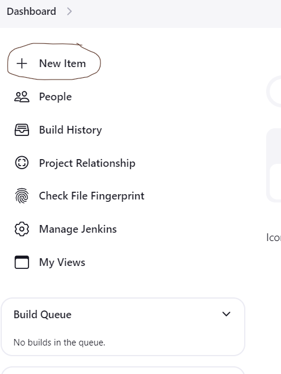
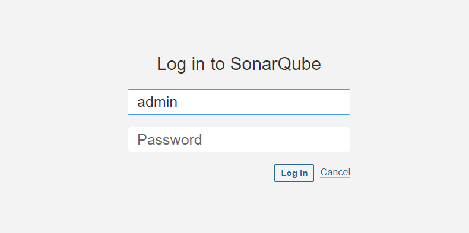
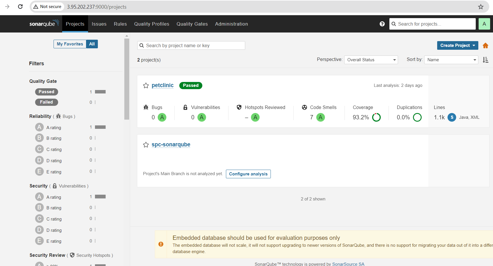

### Installing Jenkins and Integrating SonarQube With Jenkins:
--------------------------------------------------------------
* Firstly, Login into AWS account with necessary credentials then select EC2 Service in AWS console, to create the server to run Jenkins inside the server.
* Now create an EC2 instance with the operating system of our choice. Here, I have selected **ubuntu-22.04** as **OS** and I have given the name as **Jenkins-master** and I have selected **t2.micro** as the size for the **OS** which is a free tier instance which will be enough to host jenkins.


* While creating the EC2 instance I have used self-generated key pair using `ssh-keygen` command to authenticate with the server. 
* After generating the keypair we will get two keys, one is public and another is private with the key names as `id_rsa`(private-key) and `id_ras.pub`(public-key) in `.ssh` folder of the host home path where we ran the above command.
* `SSH(Secure Shell)` uses `RSA(Rivest-Shamir-Adleman)` algorithm to generate keys for encryption and authentication purposes. It can also support other algorithms like `DSA(Digital Signature Algorithm)` and `ECDSA(Elliptic Curve Digital Signature Algorithm)`.
* As we are using AWS we need to pass the public key to AWS keypairs and the private-key will be with us for server authentication. We can also create the keypair in AWS console.


*  I have also created a security group and I have opened `22(SSH)` and `8080` ports like in the above pic for server authentication and to access Jenkins respectively.


* Then I have logged into EC2 instance using `ssh username@publicip` of the server.


* After successful login to the server, I have updated the ubuntu packages using `sudo apt update` command.


* Then I have installed java11 using `sudo apt install openjdk-11-jdk -y`.
* Here I have installed java11 because Jenkins was written on java and to run Jenkins, we must need java. The minimum version should be java11 at least to run Jenkins.

Note:
-----
* Java11 will no longer be supported by Jenkins from `October 2024` and it will be deprecated so we need to you Java17 from there on.


* Now check wheater the java is installed or not using `java --version` command as shown below.


* Then I have created a shell script file with jenkins.sh as name, using `touch Jenkins.sh` command.
* Then I have opened the shell script file with vim editor using `vi jenkins.sh` command.


* After that I have added the below data in the shell script file to install Jenkins and saved the file using `:wq` instruction in `vi` editor(Use `:q` to exit out of the editor without saving the contents in the file).
* we can also follow the official documentation of jenkins for the installation steps and we can directly run them in the server.


[Installing Jenkins in Linux](https://www.jenkins.io/doc/book/installing/linux/)

[Installing Jenkins in Ubuntu](https://www.jenkins.io/doc/book/installing/linux/#debianubuntu)

```bash
#!/bin/bash
sudo wget -O /usr/share/keyrings/jenkins-keyring.asc \
https://pkg.jenkins.io/debian-stable/jenkins.io-2023.key
echo "deb [signed-by=/usr/share/keyrings/jenkins-keyring.asc]" \
https://pkg.jenkins.io/debian-stable binary/ | sudo tee \
/etc/apt/sources.list.d/jenkins.list > /dev/null
sudo apt-get update
sudo apt-get install Jenkins -y
```

* After placing the above contents in the shell script file run the shell script using
`sh jenkins.sh` command to run the script which will install jenkins in our server as below.


*  The above lines in the script will install Jenkins to do that I have ran `sh Jenkins.sh` command to execute the script then we need to access Jenkins using the **PublicIp** of the server on `8080` port.


* After accessing the web page of Jenkins then we need to give the password to the Jenkins which will be present in `/var/lib/jenkins/secrets/intialAdminPassword` path of the Jenkins host, using `sudo cat /var/lib/jenkins/secrets/intialAdminPassword` we need to set a user with credentials, then we can login to Jenkins.


* After the installing jenkins we need to configure the user with credentials by following below steps then we can able to configure jenkins with that user.It is better to save these credentials(username and password) as these credentials are essential to login to the jenkins server.


* After accessing the Jenkins home page then we can able to Jenkins Dashboard like the below then we need to create the type of project of our choice then run the pipelines.


* These are the steps that I have followed to install the Jenkins in **Ubuntu** server.

### SonarQube Integration with Jenkins for a Java project:
----------------------------------------------------------

* Firstly, We need to create an another EC2 instance will be the `node` or `slave` to build and deploy our project and then we need to configure this with Jenkins-Master.
  
* After creating the EC2 instance login to the server just like we did for Jenkins-Master using `ssh username@publicIP` command then update the ubuntu packages using `sudo apt update` command.

* To connect the node to the Jenkins-Master we need some requirements and follow some steps.

* The requirements are the node should have java installed to configure with master, Here I have installed java-17 in the node using `sudo apt install openjdk-17-jdk -y` command.
  
* After Installing Java Go to the Jenkins Dashboard and select manage Jenkins as in the below pic 


  
* In Manage Jenkins We see an option of adding nodes in nodes section, which is shown in the below pic.


  
* After selecting the nodes option, you will see an option to add new node, select that new node option, then give a name to the node, select permanent agent and then create, this will add node to Jenkins, then we need to configure the node with Jenkins with node credentials by following the below steps. 


  
* At No. of Executors give the number on how many parallel jobs that can run at once, here I have selected `1`. 
  
* At Remote Root Directory give a path at which you want to  clone the repositories in the node, so that Jenkins will clone the repositories in this path which were given in the pipeline, here, I have give the path as /home/ubuntu/sonar ( this will create a folder called “sonar” in the home path of the ubuntu server and clone the repositories in this folder).


  
* At Labels section give a label to the node, Jenkins will able to differentiate the nodes and runs the pipelines based on the node labels only. Here I have given the label name as `sonar-spc`.  
* At usage section select `label expression matching node` option. 
  
* At launch method select `launching via ssh` option, at `Host` option give the privateIp of the node, at `host key verification strategy` select the non verifying strategy and to add the credentials follow the below steps 


  
* At `credentials` section select add credentials and in that select username and ssh private key authentication option, then give the username of the node and the private key of the key pair which we have used while creating the node/slave. After doing this process you will see the credentials at the credentials option and select the credentials.
  


  
* At availability select `keep this node online as much as possible` option.
  
* Then select `save` to configure the node with Jenkins then at nodes section you will see the nodes is now configured with Jenkins and ready to run pipelines in that node.


* After successful node configuration we need to create a project at Jenkins Dashboard.


* We can create Free Style Project, pipeline project, multi-stage pipeline project according to the need. Here, I have selected pipeline project as I have written a pipeline to build and run SonarQube scan for an open-source Java project.
  
  


* For the project I have taken an open-source java project called `spring-petclinic` from GitHub repository.

[Repository Link](https://github.com/spring-projects/spring-petclinic)
  
* First we need to fork the repository, then we need to clone the repository in the local using the repo link with the command `git clone <repo-URL>`.


* To clone any git repository we need to install Git. Follow the installation steps any article over the internet and install git.

* After installing git we need to configure the git with our github account credentials using the following commands

* `git config --global user.name <github-username>`
* `git config --global user.email <github-email>`
* `git config --global user.password <github-token>`
  
* To generate GitHub token go to the settings option in GitHub account and select developer settings and then tokens, in that select PAT token (classic) with necessary permissions for the token.
  
* After the cloning the repo like above go to that repository using `cd <repo-folder>`.
* As I have created a pipeline project in Jenkins we need to write pipeline and keep the pipeline in the repository.
* The name of this file should be `Jenkinsfile`.
* We can write the pipeline in two formats one is in `scripted` format and another is `Declarative` format. Here, I have used declarative format approach to write the pipeline.
* Below are the contents of the my Jenkinsfile.

```groovy
  pipeline{
    agent {
        label 'sonar-spc'
    }
    triggers {
        pollSCM('* * * * *')
    }
    stages {
        stage('clone'){
            steps{
                git url: 'https://github.com/spring-projects/spring-petclinic.git',
                    branch: 'sonarqube'
            }
        }
        stage('build'){
            steps {
                    sh "./mvnw clean package" 
            }
        }
    }
}
```

* After completing the Jenkinsfile we need to push the Jenkinsfile changes to our github repository using the following commands.

* `git add .` (To add the changes to git staging area)
* `git commit -m “any commit message which suits our changes”` (To commit the changes to local git repository)
  
* `git push -u origin <current-branch-name>` ( To push the changes remote-repository) [ to know the current branch use `git branch` command].
* After pushing our changes to the remote repository we need to run the pipeline in Jenkins using the Jenkinsfile which we have written in the node that we have configured above.
  
* To run the pipeline we need to make some changes in the pipeline project that we have created before or we can create a new pipeline project and can do the changes. Follow the steps like in the below pics to know the changes
  


* After making the necessary changes run the pipeline by clicking on `Build now` at pipeline Dashboard and If all the configurations that we have done is correct pipeline will run and it clones our repository and it builds the code and it will give a package (Artifact) of our code.


* Here, as I have used Java project, we will get the artifact which is the `.jar` file in target folder as shown below.


  
* Then we just need to run this jar file to access our application using “java -jar <.jar file>”. Access the application using the publicIP of the node port 8080.
  
* Now we need to Install SonarQube in the Master to do code analysis and code coverage.
  
* Here, I have installed SonarQube using docker, for this we need to install Docker in the master using the below steps.

[Docker Install Script](https://get.docker.com)

`curl -fsSL https://get.docker.com -o install-docker.sh` && `sh install-docker.sh`


  
* After installing the docker add the user to the docker group using the command `sudo usermod -aG docker <user-name>`, then logout of the server and login again to run the docker.
  
* Then we need to run sonarqube container using sonarqube image. Here I have used `sonarqube:9.9.4-community` image from dockerhub.

* To run the sonarqube container I have used the following command `docker container run -d -p 9000:9000 –-name sonarqube sonarqube:9.9.4-community`.


  
* This will run sonarqube in the master, access the sonarqube from the portal using `publicIp` of the master on `9000` port,
this will ask for credentials use `admin` for both username and password then update the password, then you can able to view the sonarqube dashboard.



* Now we need install `sonarqube scanner` plugin in Jenkins.
  
* To install the plugin go to the plugins option in manage Jenkins in Jenkins dashboard, then select available plugins and search sonarqube scanner plugin and install it, after installing the plugin restart the Jenkins server.


  
* Now we need to configure the sonarqube with Jenkins, for this go to the manage Jenkins and select configuration and search for sonarqube, at the sonarqube configuration give the sonarqube server ip address with port at host sections, give a name to the configuration, at the token section generate a token in sonarqube dashboard add the token in the credentials and select the token and save the configuration.
  
  

  
* To generate the sonarqube token go to the sonarqube dashboard and select the profile and administration and in the security you can generate the token.


  
* After the above configuration, change the pipeline configuration as below for sonarqube configuration.
  
```groovy 
pipeline{
    agent {
        label 'sonar-spc'
    }
    triggers {
        pollSCM('* * * * *')
    }
    stages {
        stage('clone'){
            steps{
                git url: 'https://github.com/spring-projects/spring-petclinic.git',
                    branch: 'sonarqube'
            }
        }
        stage('build'){
            steps {
                withSonarQubeEnv('sonar-qube') {
                    sh "./mvnw clean package sonar:sonar"
                }
            }
        }
    }
}
```
* This configuration will integrate sonarqube with Jenkins and runs the sonarqube scan to the code during the build.
  
* After the successfull build, you can see new icon in Jenkins pipeline dashboard which represents sonar scan, you can see code quality and coverage report in sonarqube dashboard.



  
* Here, as I have used Java project, we will get the artifact which the `.jar` file in target folder as shown below.


	
* Then we just need to run this jar file to access our application using `java -jar <.jar file>` in the node and then, Access the application using the publicIP of the node port 8080.


* This is the process that I have followed to integrate the sonarqube with Jenkins.
