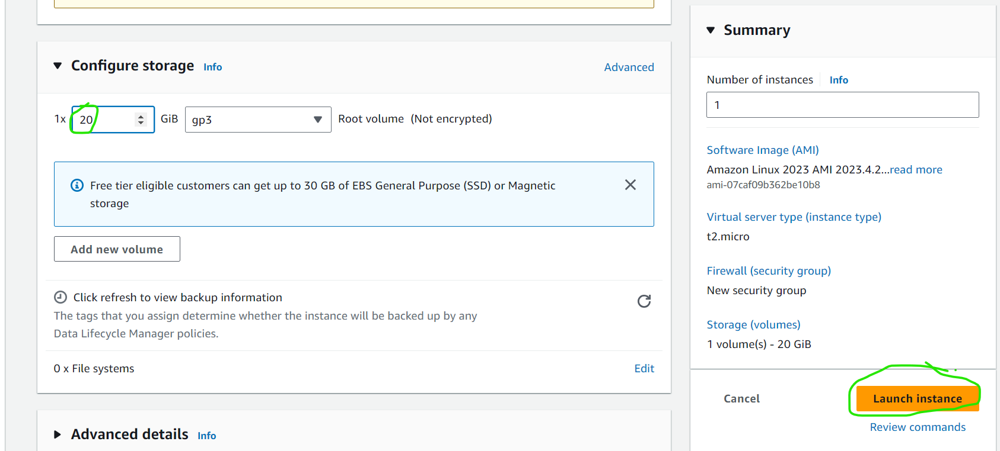
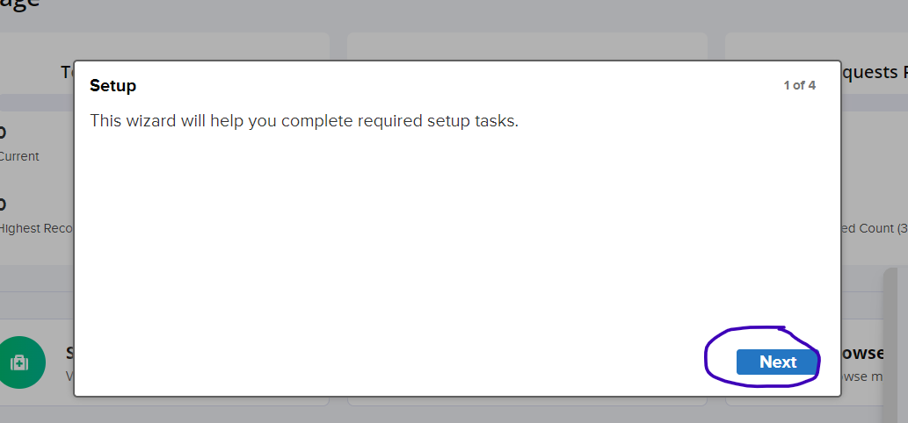
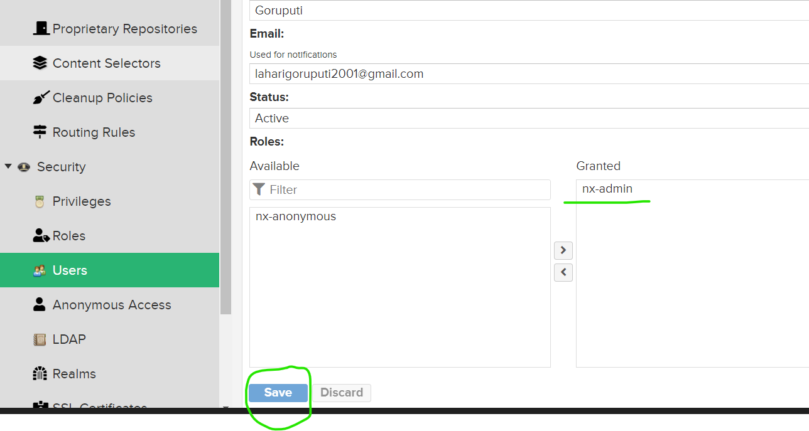

### Configuring Nexus Repository with Jenkins
-------------------------------------------
---
* Nexus is a open-source package repository which stores the artifact build from the code.Jenkins is an one of the most popular open source ci/cd automation tool.
* Firstly, login into AWS account with necessary credentials then select EC2 Service in AWS console, to create the server to run Jenkins inside the server.
* Now create an EC2 instance with the operating system of our choice. Here, I have selected **ubuntu-22.04** as **OS** and I have given the name as **Jenkins-nexus** and I have selected **t2.medium** as the size for the **OS**,with `20GiB` of storage to host jenkins and nexus.
* Nexus server requries atleast `2vCpu's` and `15Gib` of storage.


* While creating the EC2 instance I have used self-generated key pair using `ssh-keygen` command to authenticate with the server. 
* After generating the keypair we will get two keys, one is public and another is private with the key names as `id_rsa`(private-key) and `id_ras.pub`(public-key) in `.ssh` folder of the host home path where we ran the above command.
* `SSH(Secure Shell)` uses `RSA(Rivest-Shamir-Adleman)` algorithm to generate keys for encryption and authentication purposes. It can also support other algorithms like `DSA(Digital Signature Algorithm)` and `ECDSA(Elliptic Curve Digital Signature Algorithm)`.
* As we are using AWS we need to pass the public key to AWS keypairs and the private-key will be with us for server authentication. We can also create the keypair in AWS console.

* I have also created a security group and I have opened `22(SSH)` and `8080` ports like in the above pic for server authentication and to access Jenkins respectively.





* Then I have logged into EC2 instance using `ssh username@publicIP` of the server.


* After successful login to the server, I have updated the ubuntu packages using `sudo apt update` command.


* Here I have hosted Jenkins and Nexus using docker to make the installation simple.
* Below are the steps and docker images that i have used to install Jenkins and Nexus.

[Installing docker](https://get.docker.com)


* Installing Jenkins:
      `docker container run -d -p 8080:8080 --name jenkins jenkins/jenkins:lts-jdk17`

* In the above command  `jenkins/jenkins:lts-jdk17` is the docker image to run jenkins    

* Installing Nexus:
           `docker container run -d -p 8081:8081 --name nexus sonatype/nexus3:latest`

* In the above command `sonatype/nexus3:latest` is the docker image to run nexus.

* After the containers came into running state access Jenkins(8080) and Nexus(8081) on their respective ports using the publicIP of the server.

* After accessing the web page of Jenkins then we need to give the password to the Jenkins which will be present in `/var/lib/jenkins/secrets/intialAdminPassword` path of the Jenkins host, using `sudo cat /var/lib/jenkins/secrets/intialAdminPassword` we need to set a user with credentials, then we can able to login to Jenkins.


* After the installing jenkins we need to configure the user with credentials by following below steps then we can able to configure jenkins with that user.It is better to save these credentials(username and password) as these credentials are essential to login to the jenkins server.


* After accessing the Jenkins home page then we can able to see Jenkins Dashboard, then we need to create the type of project of our choice then run the pipelines.       
* Just like how we access the jenkins we need to access Nexus also.


* After accessing the nexus dashboard we need to get the credentials of the nexus, username which will be admin by default and we need to get the password from the nexus container, from the path
given by nexus when we access it. Then get the path, login to the nexus container and then use `cat /nexus-data/admin.password` command to get the password and use that password to login to nexus dashboard.





* Then we need to create a repository sections in nexus dashboard as below

  


  

* Then we need to create a user in nexus dashboard to authenticate nexus repository with jenkins.




* Then login to the jenkins dashboard and install nexus artifact uploader plugin at plugins section in jenkins dashboard to integrate nexus with it.


* Now we need to configure Nexus Repository with the credentials which we have created above in the nexus with Jenkins inorder to let know Jenkins about then Nexus repository details. For this we need to go to Jenkins credentials sections and add the credentials of the Nexus repository as below. We need to have an ID for the credentials which we need to use it the pipeline after.


* We can write the pipeline in two formats one is in `scripted` format and another is `Declarative` format. Here, I have used declarative format approach to write the pipeline.

* Now we need to write the pipeline which will integrate nexus repository with jenkins to upload the artifacts which were generated from the build.
* Below is the pipeline which wil build the code(This pipeline will not push artifact to Nexus).
 
```groovy
pipeline{
    agent {
        label 'nexus'
    }
    triggers {
        pollSCM('* * * * *')
    }
    stages {
        stage('clone'){
            steps{
                git url: 'https://github.com/spring-projects/spring-petclinic.git',
                    branch: 'nexus'
            }
        }
        stage('build'){
            steps {
                sh "./mvnw clean package" 
            }
        }
    }
}
``` 

* Now we need to create an another EC2 instance which will be the `node` or `slave` to build and deploy our project and then we need to configure this with Jenkins-Nexus.

* After creating the EC2 instance login to the server just like we did for Jenkins-Master using `ssh username@publicIP` command then update the ubuntu packages using `sudo apt update` command.

* To connect the node to the Jenkins-Nexus we need some requirements and follow some steps.

* The requirements are the node should have java installed to configure with master, Here I have installed java-17 in the node using `sudo apt install openjdk-17-jdk -y` command.
  
* After Installing Java Go to the Jenkins Dashboard and select manage Jenkins as below


* In Manage Jenkins We see an option of adding nodes in nodes section, which is shown in the below pic.


* After selecting the nodes option, you will see an option to add new node, select that new node option, then give a name to the node, select permanent agent and then create, this will add node to Jenkins, then we need to configure the node with Jenkins with node credentials by following the below steps.


* At No. of Executors give the number on how many parallel jobs that can run at once, here I have selected `1`. 
  
* At Remote Root Directory give a path at which you want to  clone the repositories in the node, so that Jenkins will clone the repositories in this path which were given in the pipeline, here, I have give the path as /home/ubuntu/nexus ( this will create a folder called “nexus” in the home path of the ubuntu server and clone the repositories in this folder).


* At Labels section give a label to the node, Jenkins will able to differentiate the nodes and runs the pipelines based on the node labels only. Here I have given the label name as `nexus`.  
* At usage section select `label expression matching node` option. 
  
* At launch method select `launching via ssh` option, at `Host` option give the privateIp of the node, at `host key verification strategy` select the non verifying strategy and to add the credentials follow the below steps 

* At `credentials` section select add credentials and in that select username and ssh private key authentication option, then give the username of the node and the private key of the key pair which we have used while creating the node/slave. After doing this process you will see the credentials at the credentials option and select the credentials.
* At availability select `keep this node online as much as possible` option.
  
* Then select `save` to configure the node with Jenkins then at nodes section you will see the nodes is now configured with Jenkins and ready to run pipelines in that node.


* After successful node configuration we need to create a project at Jenkins Dashboard.

* We can create Free Style Project, pipeline project, multi-stage pipeline project according to the need. Here, I have selected pipeline project as I have written a pipeline to build and store the artifactory into an open source package repository called `Nexus` for an open-source Java project.


* For the project I have taken an open-source java project called `spring-petclinic` from GitHub repository.

[Repository Link](https://github.com/spring-projects/spring-petclinic)

* First we need to fork the repository, then we need to clone the repository in the local using the repo link with the command `git clone <repo-URL>`.


* To clone any git repository we need to install Git. Follow the installation steps any article over the internet and install git.

* After installing git we need to configure the git with our github account credentials using the following commands

* `git config --global user.name <github-username>`
* `git config --global user.email <github-email>`
* `git config --global user.password <github-token>`
  
* To generate GitHub token go to the settings option in GitHub account and select developer settings and then tokens, in that select PAT token (classic) with necessary permissions for the token.
  
* After the cloning the repo like above go to that repository using `cd <repo-folder>`.
* As I have created a pipeline project in Jenkins we need to write pipeline and keep the pipeline in the repository.
* The name of this file should be `Jenkinsfile`.

```groovy
pipeline{
    agent{
        label 'nexus'
    }
    triggers{
        pollSCM('* * * * *')
    }
    stages{
        stage('clone'){
            steps{
                git url: 'https://github.com/lahari104/spring-petclinic.git',
                    branch: 'nexus'
            }
        }
        stage('build'){
            steps{
                sh "./mvnw clean package"
            }
        }
        stage('nexus'){
            steps{
                script {
                    pom = readMavenPom file: "pom.xml";
                    filesByGlob = findFiles(glob: "target/*.jar");
                    echo "${filesByGlob[0].name} ${filesByGlob[0].path} ${filesByGlob[0].directory} ${filesByGlob[0].length} ${filesByGlob[0].lastModified}"
                    artifactPath = filesByGlob[0].path;
                    artifactExists = fileExists artifactPath;
                    if(artifactExists) {
                        echo "*** File: ${artifactPath}, group: ${pom.groupId}, packaging: ${pom.packaging}, version ${pom.version}";
                        nexusArtifactUploader(
                            nexusVersion: 'nexus3',
                            protocol: 'http',
                            nexusUrl: '100.25.4.7:8081',
                            groupId: 'org.springframework.samples',
                            version: '3.0.0-SNAPSHOT',
                            repository: 'maven-nexus',
                            credentialsId: 'NexusID',
                            artifacts: [
                                [artifactId: 'spring-petclinic',
                                classifier: '',
                                file: "target/spring-petclinic-3.0.0-SNAPSHOT.jar",
                                type: "jar"]
                                
                            ]
                        );
                    } 
                    else {
                        error "*** File: ${artifactPath}, could not be found";
                    }
                }
            }
        }
    }
}
```

* After completing the Jenkinsfile we need to push the Jenkinsfile changes to our github repository using the following commands.

* `git add .` (To add the changes to git staging area)
* `git commit -m “any commit message which suits our changes”` (To commit the changes to local git repository)
  
* `git push -u origin <current-branch-name>` ( To push the changes remote-repository) [ to know the current branch use `git branch` command].
* After pushing our changes to the remote repository we need to run the pipeline in Jenkins using the Jenkinsfile which we have written in the node that we have configured above.

* To run the pipeline we need to make some changes in the pipeline project that we have created before or we can create a new pipeline project and can do the changes. Change the name of the branch to your branch in the place of `*/master` in the below pic and Follow the steps like in the below pics to know the changes.


* After making the necessary changes run the pipeline by clicking on `Build now` at pipeline Dashboard and If all the configurations that we have done is correct pipeline will run and it clones our repository and it builds the code and it will give a package (Artifact) of our code.
  


* Here `jar` file will be generated as the artifact, all the vadilations in the pipeline were configured correctly with nexus this artifact generated will be pushed to nexus repository which we have created earlier.
* Here, as I have used Java project, we will get the artifact which is the `.jar` file in target folder as shown below.


* Then go to the nexus dashboard and open the repository which we have created and we can able to see the artifact which is pushed from the pipeline.


* Then we just need to run this jar file to access our application using `java -jar <.jar file>`. Access the application using the publicIP of the node on port `8080`.


