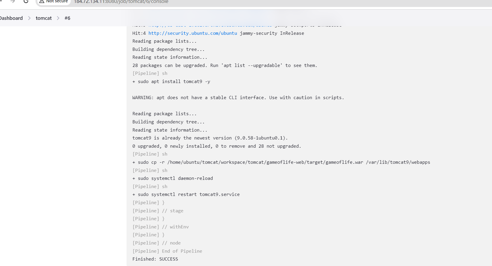

### Installing Jenkins and Integrating tomcat With Jenkins:
------------------------------------------------------------
* Jenkins is an open-source CI-CD automation tool.
* tomcat is a web server used for hosting java-based applications on the web.

* Firstly, Login into AWS account with necessary credentials then select EC2 Service in AWS console, to create the server to run Jenkins inside the server.
* Now create an EC2 instance with the operating system of our choice. Here, I have selected **ubuntu-22.04** as **OS** and I have given the name as **Jenkins-master** and I have selected **t2.micro** as the size for the **OS** which is a free tier instance which will be enough to host jenkins.


* While creating the EC2 instance I have used self-generated key pair using `ssh-keygen` command to authenticate with the server. 
* After generating the keypair we will get two keys, one is public and another is private with the key names as `id_rsa`(private-key) and `id_ras.pub`(public-key) in `.ssh` folder of the host home path where we ran the above command.
* `SSH(Secure Shell)` uses `RSA(Rivest-Shamir-Adleman)` algorithm to generate keys for encryption and authentication purposes. It can also support other algorithms like `DSA(Digital Signature Algorithm)` and `ECDSA(Elliptic Curve Digital Signature Algorithm)`.
* As we are using AWS we need to pass the public key to AWS keypairs and the private-key will be with us for server authentication. We can also create the keypair in AWS console.


* I have also created a security group and I have opened `22(SSH)` and `8080` ports like in the above pic for server authentication and to access Jenkins respectively.


* Then I have logged into EC2 instance using `ssh username@publicip` of the server.


* After successful login to the server, I have updated the ubuntu packages using `sudo apt update` command.


* Then I have installed java11 using `sudo apt install openjdk-11-jdk -y`.
* Here I have installed java11 because Jenkins was written on java and to run Jenkins, we must need java. The minimum version should be java11 at least to run Jenkins.

Note:
-----
* Java11 will no longer be supported by Jenkins from `October 2024` and it will be deprecated so we need to use higher java version from there on.


* Now check wheater the java is installed or not using `java --version` command as shown below.


* Then I have created a shell script file with jenkins.sh as name, using `touch Jenkins.sh` command.

* Then I have opened the shell script file with vim editor using `vi jenkins.sh` command.


* After that I have added the below data in the shell script file to install Jenkins and saved the file using `:wq` instruction in `vi` editor(Use `:q` to exit out of the editor without saving the contents in the file).

```bash
#!/bin/bash
sudo wget -O /usr/share/keyrings/jenkins-keyring.asc \
https://pkg.jenkins.io/debian-stable/jenkins.io-2023.key
echo "deb [signed-by=/usr/share/keyrings/jenkins-keyring.asc]" \
https://pkg.jenkins.io/debian-stable binary/ | sudo tee \
/etc/apt/sources.list.d/jenkins.list > /dev/null
sudo apt-get update
sudo apt-get install Jenkins -y
```

* we can also follow the official documentation of jenkins for the installation steps and we can directly run them in the server.


[Installing Jenkins in Linux](https://www.jenkins.io/doc/book/installing/linux/)

[Installing Jenkins in Ubuntu](https://www.jenkins.io/doc/book/installing/linux/#debianubuntu)


* After placing the above contents in the shell script file run the shell script using
`sh jenkins.sh` command to run the script which will install jenkins in our server as below.


*  The above lines in the script will install Jenkins, to do that I have ran `sh Jenkins.sh` command to execute the script then we need to access Jenkins using the **PublicIp** of the server on `8080` port.


  
* After accessing the web page of Jenkins then we need to give the password to the Jenkins which will be present in `/var/lib/jenkins/secrets/intialAdminPassword` path of the Jenkins host, using `sudo cat /var/lib/jenkins/secrets/intialAdminPassword` we need to set a user with credentials, then we can login to Jenkins.


* After the installing jenkins we need to configure the user with credentials by following below steps then we can able to configure jenkins with that user. It is better to save these credentials(username and password) as these credentials are essential to login to the jenkins server.


* After accessing the Jenkins home page then we can able to see Jenkins Dashboard like the below then we need to create the type of project of our choice then run the pipelines.


* These are the steps that I have followed to install the Jenkins in **Ubuntu** server.

* Firstly, We need to create an another EC2 instance will be the `node` or `slave` to build and deploy our project and then we need to configure this with Jenkins-Master.
  
* After creating the EC2 instance login to the server just like we did for Jenkins-Master using `ssh username@publicIP` command then update the ubuntu packages using `sudo apt update` command.

* To connect the node to the Jenkins-Master we need some requirements and follow some steps.

* The requirements are the node should have java installed to configure with master, Here I have installed java-11 & java-8 in the node using `sudo apt install openjdk-11-jdk -y` & `sudo apt install openjdk-8-jdk -y` command.

* Now we have java versions present in the node and we can verify which java version is used by default by the node using `java -version` command.


* We need java-11 as the minimum requirement to connect a node with jenkins and here, we are using java-8 to build the code of the project which I'm going to use.

[Project URL](https://github.com/wakaleo/game-of-life)

* To build this project we need to set the default java version as `8`, for this we need to add the path of our java-8 to the `PATH` variable. (If the default version is `8` then we don't need to do this below process). Follow the below steps:

* First check the java path where it presents using `cd /usr/lib/jvm` command which is the default path of java, by default all the java versions present in this path. Now, we can see multiple java versions present in this path if you run `ls` command like in the below pic


* Open the `PATH` variable with an editor using `sudo vi /etc/environment` command.


* Now add the java-8 path at the start of this variable and save this file and exit.


* As we have changed the `PATH` variable here we need to refresh this in order to get the changes we have changed in the above. To refresh we need to use `source /etc/environment` command, this will refresh the `PATH` variable and now if we check the java version if will show the `java-8` as the default java.


* After setting the java version in the node, we need to set `java-11` path at global tools option in Jenkins Dashboard, this is because we have multiple java versions in the node and we have `java-8` as default but we need`java-11` to connect this node with Jenkins.

* For this go the manage jenkins then tools and select add JDK installations, in this give a name to the JDK and give the path of java-11 (/usr/lib/jvm/<java-11>) at `JAVA_HOME` and save the configuration.


* After completing the above steps Go to the Jenkins Dashboard and select manage Jenkins and select nodes option inorder to connect the node with Master as in the below pic.


* After selecting the nodes option, you will see an option to add new node, select that new node option, then give a name to the node, select permanent agent and then create, this will add node to Jenkins, then we need to configure the node with Jenkins with node credentials by following the below steps. 
  
* At No.of Executors give the number for no.of parallel jobs that can run at once, Here I have selected `1`. 
  
* At Remote Root Directory give a path at which you want to clone the repositories in the node, so that Jenkins will clone the repositories in this path which were given in the pipeline, here, I have give the path as `/home/ubuntu/tomcat` ( this will create a folder called `tomcat` in the home path of the ubuntu server and clone the repositories in this folder).


  
* At Labels section give a label to the node, Jenkins will able to differentiate the nodes and runs the pipelines and builds the code inside the nodes based on the node labels only. Here I have given the label name as `tomcat`.

* At usage section select `label expression matching node` option. 
  
* At launch method select `launching via ssh` option, at `Host` option give the privateIp of the node, at `host key verification strategy` select the non verifying strategy and to add the credentials follow the below steps 
  
* At `credentials` section select add credentials and in that select username and ssh private key authentication option, then give the username of the node and the private key of the key pair which we have used while creating the node/slave. After doing this process you will see the credentials at the credentials option and select the credentials.
  

  
* At availability select `keep this node online as much as possible` option.

* At the Node properties select tool locations and select the JDK version with the name which we have given above at the Global tools and add the java-11 path.
  
* Then select `save` to configure the node with Jenkins then at nodes section you will see the nodes is now configured with Jenkins and ready to run pipelines in that node.


* After successful node configuration we need to create a project at Jenkins Dashboard.

* Now create a project at Jenkins dashboard 


* We can create Free Style Project, pipeline project, multi-stage pipeline project according to the need. Here, I have selected pipeline project as I have written a pipeline to build and run for an open-source Java project using tomcat as a web server to run the application.


* For the project I have taken an open-source java project called `gameoflife` from GitHub repository.

[Repository Link](https://github.com/wakaleo/game-of-life)

* First we need to fork the repository, then we need to clone the repository in the local using the repo link with the command `git clone <repo-URL>`.

* To clone any git repository we need to install Git. Follow the installation steps using any article over the internet and install git.

* After installing git we need to configure the git with our github account credentials using the following commands

* `git config --global user.name <github-username>`
* `git config --global user.email <github-email>`
* `git config --global user.password <github-token>`
  
* To generate GitHub token go to the settings option in GitHub account and select developer settings and then tokens, in that select PAT token (classic) with necessary permissions for the token.
  
* After the cloning the repo like above go to that repository using `cd <repo-folder>`.
* As I have created a pipeline project in Jenkins we need to write pipeline and keep the pipeline in the repository.

* The name of this file should be `Jenkinsfile`.
* We can write the pipeline in two formats one is in `scripted` format and another is `Declarative` format. Here, I have used declarative format approach to write the pipeline.
* Below are the contents of the my Jenkinsfile.

```groovy
pipeline{
    agent {
        label 'tomcat'
    }
    triggers{
        pollSCM('* * * * *')
    }
    stages{
        stage('clone'){
            steps{
                git url: "https://github.com/lahari104/game-of-life.git",
                    branch: 'tomcat'
            }
        }
        stage('build'){
            steps{
                sh 'sudo apt install maven -y'
                sh 'mvn clean package'
                
            }
        }
    }
}

```

* After completing the Jenkinsfile we need to push the Jenkinsfile changes to our github repository using the following commands.

* `git add .` (To add the changes to git staging area)
* `git commit -m “any commit message which suits our changes”` (To commit the changes to local git repository)
  
* `git push -u origin <current-branch-name>` ( To push the changes remote-repository) [ to know the current branch use `git branch` command].
* After pushing our changes to the remote repository we need to run the pipeline in Jenkins using the Jenkinsfile which we have written in the node that we have configured above.
  
* To run the pipeline we need to make some changes in the pipeline project that we have created before or we can create a new pipeline project and can do the changes. Follow the steps like in the below pics to know the changes


* After making the necessary changes run the pipeline by clicking on `Build now` at pipeline Dashboard and If all the configurations that we have done is correct pipeline will run and it clones our repository and it builds the code and it will give the package (Artifact) of our code.


* Now we need to install tomcat server in the node in order to integrate and to host our application inside the tomcat server.

* We can install tomcat9 directly using `sudo apt install tomcat9 -y` in ubuntu which is the step I have followed to install tomcat from pipeline or we can also follow any official documentation to install it by downloading the tomcat tar file.

[Download Tomcat](https://tomcat.apache.org/download-90.cgi)

* After installing tomcat in the node we need to copy the artifact which was build above (.war file) to the webapps folder of the tomcat server which will be present at `/var/lib/tomcat9/webapps` path of the node where we have installed `tomcat9`.

* Once we copied our file to the webapps folder tomcat will run the application. 

* As we have made changes in the webapps path we need to restart the tomcat service in-oder get the configuration changes which we have made

Commands:
---------
`sudo systemctl daemon-reload`
`sudo systemctl restart tomcat9.service`

* verify the tomcat service status using `sudo systemctl status tomcat9.service`
* If the service is up running then we can able to access our application on port `8080`.

* To automate this process I have integrated these steps in the jenkinsfile which I have written as below.

* Below is the pipeline that I have used to build the project which i have taken 

```groovy
pipeline{
    agent {
        label 'tomcat'
    }
    triggers{
        pollSCM('* * * * *')
    }
    stages{
        stage('clone'){
            steps{
                git url: "https://github.com/lahari104/game-of-life.git",
                    branch: 'tomcat'
            }
        }
        stage('build'){
            steps{
                sh 'sudo apt install maven -y'
                sh 'mvn clean package'
                sh 'sudo apt update'
                sh 'sudo apt install tomcat9 -y'
                sh 'sudo cp -r /home/ubuntu/tomcat/workspace/tomcat/gameoflife-web/target/gameoflife.war  /var/lib/tomcat9/webapps'
                sh 'sudo systemctl daemon-reload'
                sh 'sudo systemctl restart tomcat9.service'
                sh 'sudo systemctl status tomcat9.service'       
            }
        }
    }
}
```



* After the successful run of pipeline we can now access the application as below


